# Multi-Business Finance System - Flow Diagrams

## 📊 SYSTEM FLOW DIAGRAMS

This document contains comprehensive flow diagrams for the Multi-Business Finance System, showing user journeys, system processes, and data flows.

---

## 🔐 USER AUTHENTICATION FLOW

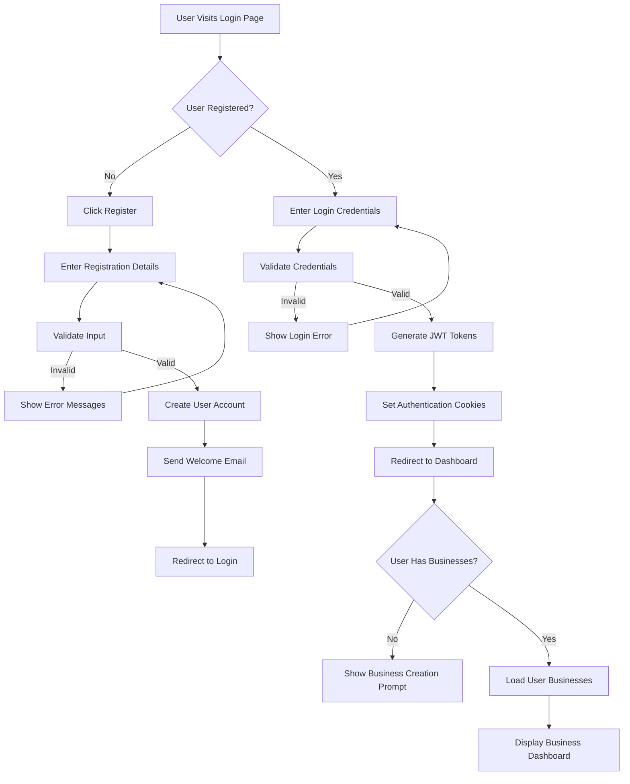

---

## 🏢 BUSINESS MANAGEMENT FLOW

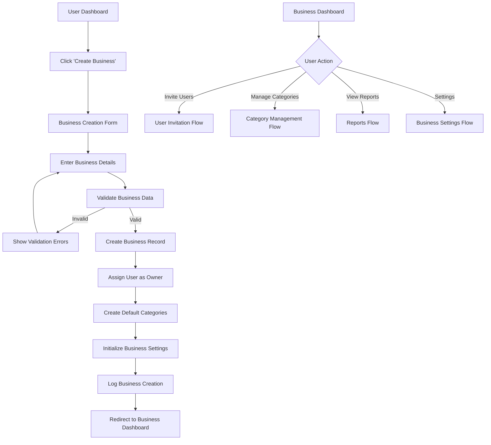

---

## 💰 TRANSACTION PROCESSING FLOW

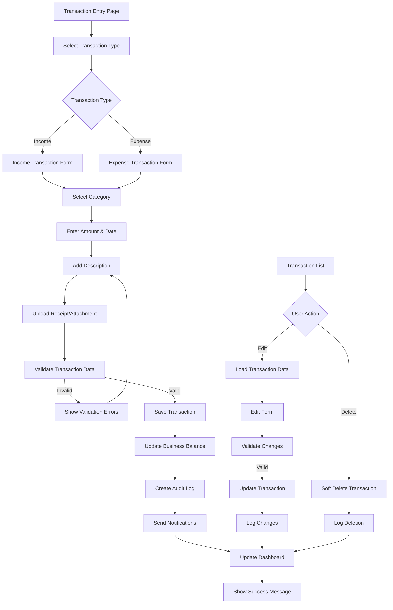

---

## 🔄 INTER-BUSINESS TRANSACTION FLOW

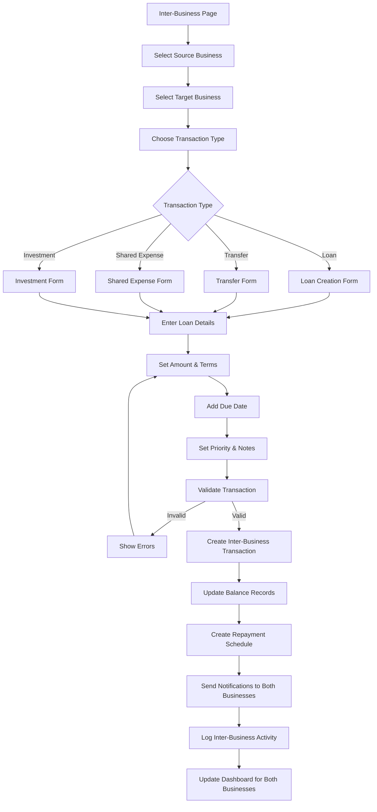

---

## 📈 ANALYTICS & REPORTING FLOW

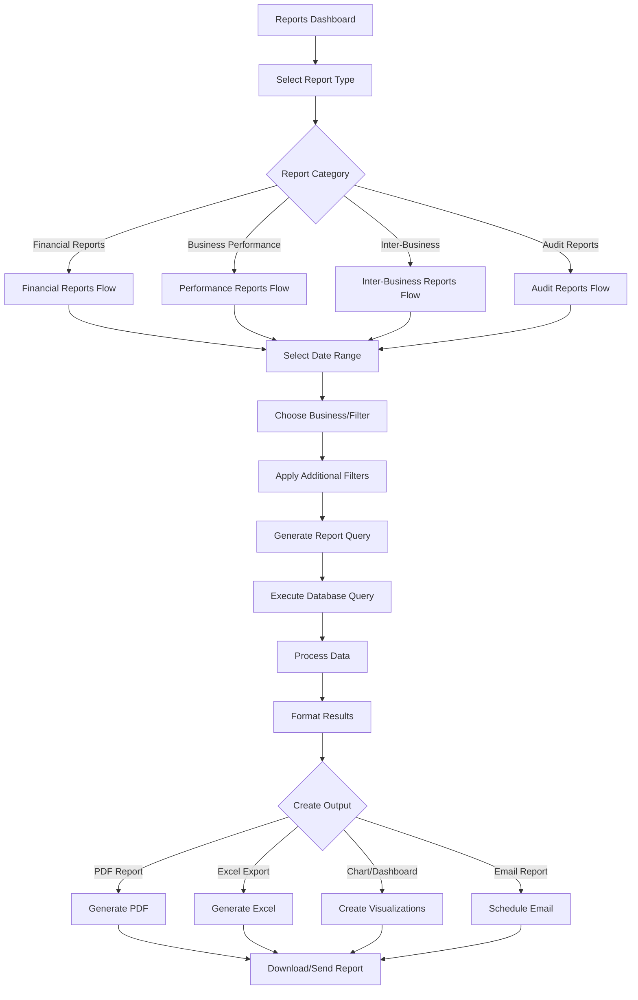

---

## 👥 USER MANAGEMENT FLOW

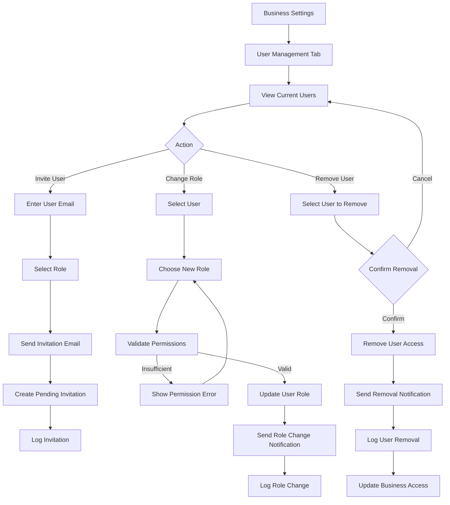

---

## 🔄 DATA SYNCHRONIZATION FLOW

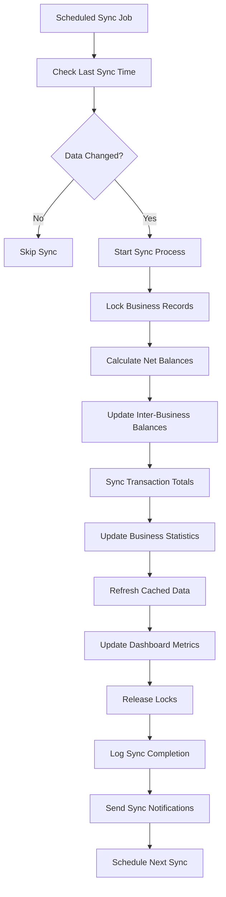

---

## 🚨 ERROR HANDLING & RECOVERY FLOW

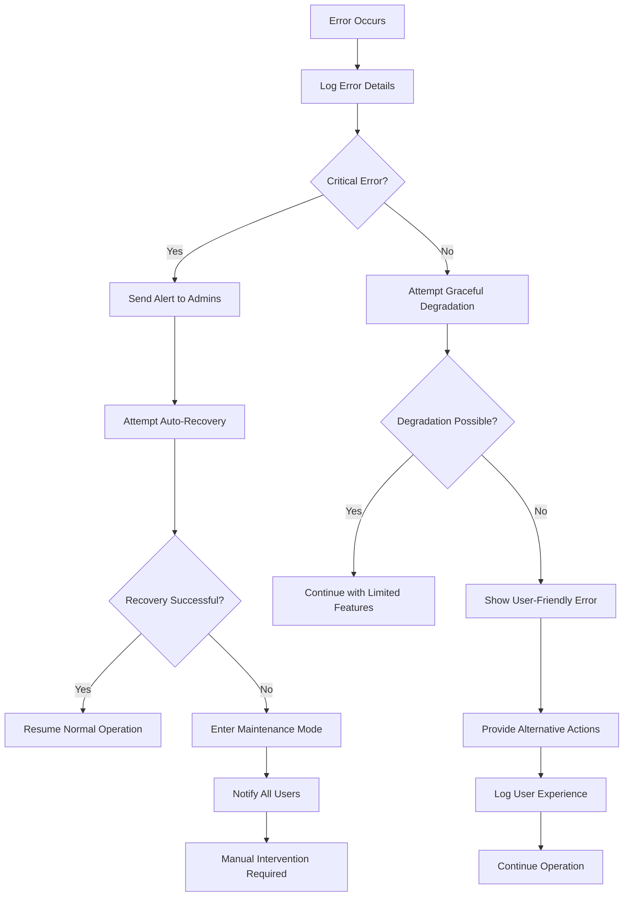

---

## 📱 MOBILE/WEB RESPONSIVE FLOW

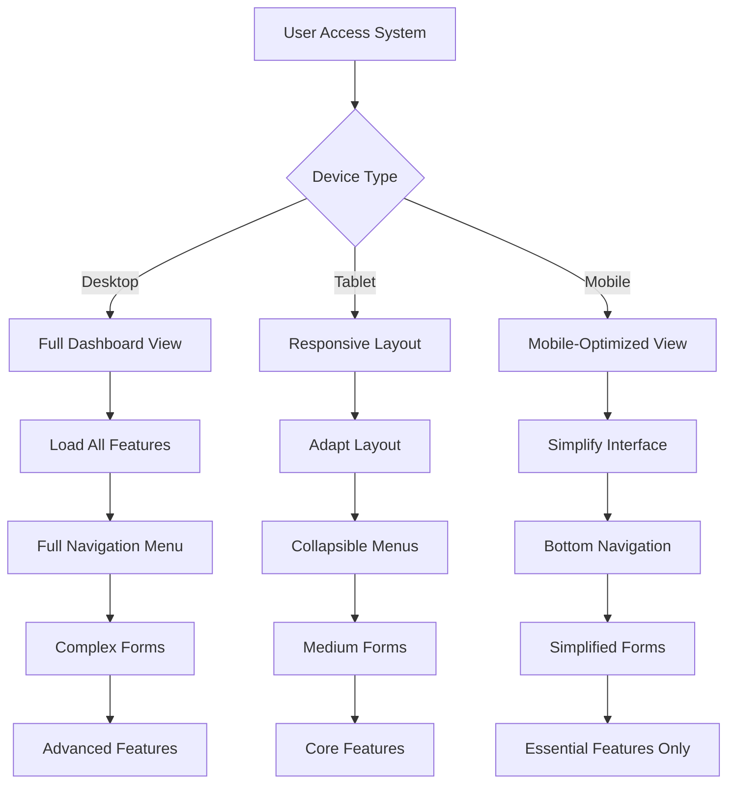

---

## 🔒 SECURITY & PERMISSIONS FLOW

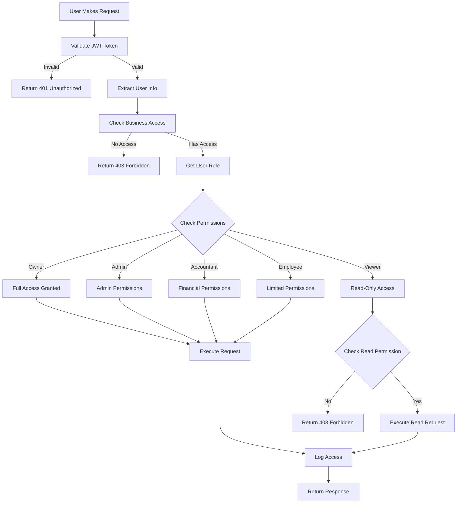

---

## 🎯 USER ONBOARDING FLOW

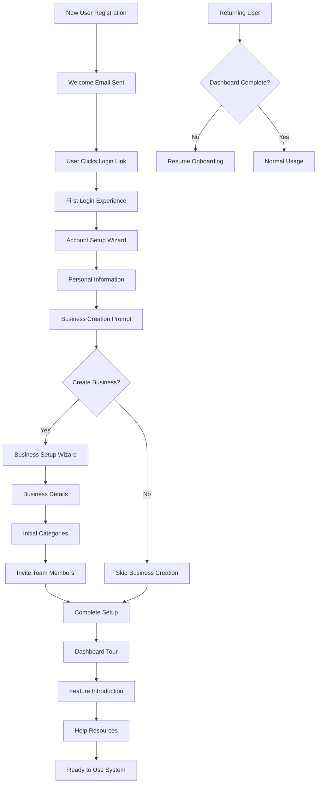

---

## 📋 LEGEND & SYMBOLS

### Flowchart Symbols:
- **Rectangle**: Process/Action
- **Diamond**: Decision Point
- **Rounded Rectangle**: Start/End
- **Arrow**: Flow Direction
- **Database Symbol**: Data Storage
- **Document**: Report/Output

### Color Coding:
- 🔵 **Blue**: User Interface Actions
- 🟢 **Green**: Successful Operations
- 🔴 **Red**: Errors/Validations
- 🟡 **Yellow**: Decisions/Branches
- 🟣 **Purple**: System Processes
- 🟠 **Orange**: Business Logic

### Flow Types:
- **→**: Sequential Flow
- **↗**: Conditional Branch
- **⤵**: Loop/Iteration
- **⟲**: Return/Error Flow

---

## 🛠️ HOW TO USE THESE DIAGRAMS

1. **Copy Mermaid Code**: Copy any flowchart code block
2. **Paste in Tool**: Use in:
   - GitHub/GitLab (supports Mermaid)
   - Mermaid Live Editor
   - Draw.io (import Mermaid)
   - Lucid (import Mermaid)
   - Notion (Mermaid plugin)

3. **Customize**: Modify colors, add details, combine flows

4. **Documentation**: Use in technical docs, presentations, or system design reviews

These flow diagrams provide a comprehensive view of your Multi-Business Finance System's user experience and system behavior.